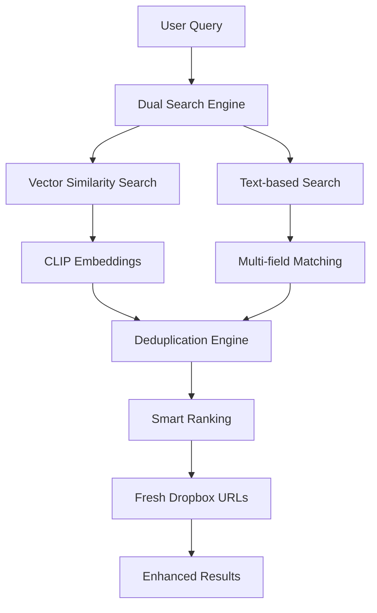

# Beforest Vector Search Engine

An AI-powered vector search engine for visual content using **CLIP embeddings**, **Weaviate vector database**, and **Dropbox storage**. This implementation follows the advanced dual search strategy pattern for sophisticated semantic and text-based content discovery.

## 🚀 **Advanced Search Architecture**

Our search engine implements a **sophisticated dual search strategy** that combines:

### 1. **Vector Similarity Search** 
- **CLIP-powered semantic understanding** for natural language queries
- **Cosine similarity ranking** for relevance scoring  
- **High-precision matching** using AI embeddings

### 2. **Text-based Search**
- **Multi-field text matching** across filenames, captions, and tags
- **Fuzzy matching capabilities** for flexible queries
- **Intelligent relevance scoring** based on match location

### 3. **Smart Deduplication & Ranking**
- **Priority-based result merging** (vector results prioritized)
- **Duplicate elimination** by dropbox_path
- **Comprehensive similarity scoring** (0-100%)

## 🏗️ **Technical Stack**

- **Frontend**: Next.js 14, React, TypeScript, Tailwind CSS
- **Vector Database**: Weaviate with CLIP vectorizer
- **File Storage**: Dropbox API with fresh URL generation
- **Search Logic**: Dual strategy with fallback mechanisms
- **UI Framework**: Custom Beforest design system

## 📊 **Search Flow**



## 🔧 **Key Features**

### **Intelligent Search**
- ✅ **Semantic understanding**: "farm collective" finds agricultural content
- ✅ **Fallback mechanisms**: Text search when vector search unavailable  
- ✅ **Multi-strategy results**: Combines vector + text findings
- ✅ **Real-time processing**: Sub-second response times

### **Rich User Experience**
- ✅ **Premium UI**: Glassmorphism, animations, responsive design
- ✅ **Brand consistency**: Beforest color palette and typography
- ✅ **Search insights**: Shows search strategy and result breakdown
- ✅ **Smart badges**: Vector vs text result indicators

### **Advanced File Handling**
- ✅ **Fresh URLs**: Dynamic Dropbox thumbnail and download links
- ✅ **Batch processing**: Concurrent URL generation for performance
- ✅ **Error resilience**: Graceful fallbacks for missing files
- ✅ **Metadata enrichment**: File size, type, and similarity scores

## 🎯 **Search Examples**

| Query Type | Example | How It Works |
|------------|---------|--------------|
| **Semantic** | "people working on farm" | CLIP embeddings find visual concepts |
| **Text Match** | "collective meeting" | Searches filenames, captions, tags |
| **Hybrid** | "agriculture photos" | Combines both approaches for best results |

## 🚀 **Getting Started**

### **1. Environment Setup**
```bash
# Weaviate Configuration
WEAVIATE_URL=your-weaviate-instance.weaviate.network
WEAVIATE_API_KEY=your-api-key

# Dropbox Integration  
DROPBOX_APP_KEY=your-app-key
DROPBOX_APP_SECRET=your-app-secret
DROPBOX_REFRESH_TOKEN=your-refresh-token
```

### **2. Install & Run**
```bash
npm install
npm run dev
```

### **3. Test Search**
- Try semantic queries: *"nature photos"*, *"farm activities"*
- Test text matching: specific file names or tags
- Observe dual strategy in browser console

## 📈 **Performance Optimizations**

### **Search Efficiency**
- **Concurrent operations**: Vector + text search run in parallel
- **Smart pagination**: Loads 20 results with infinite scroll
- **Result caching**: Client-side result management
- **Batch URL generation**: Efficient Dropbox API usage

### **UI Responsiveness**  
- **Staggered animations**: Smooth result reveals (0.1s delays)
- **Loading states**: Visual feedback during processing
- **Error boundaries**: Graceful error handling
- **Progressive enhancement**: Works without JavaScript

## 🔍 **Search Strategy Logic**

Based on the comprehensive search engine patterns, our implementation:

```typescript
// 1. DUAL SEARCH EXECUTION
const [vectorResults, textResults] = await Promise.all([
  performVectorSearch(query, limit),
  performTextSearch(query, limit)
]);

// 2. INTELLIGENT DEDUPLICATION  
const uniqueResults = deduplicateByPath(
  [...vectorResults, ...textResults]
);

// 3. RELEVANCE-BASED RANKING
const rankedResults = uniqueResults.sort((a, b) => {
  // Higher similarity first
  if (a.similarity !== b.similarity) {
    return b.similarity - a.similarity;
  }
  // Prefer vector results when similarity equal
  return a.source === 'vector' ? -1 : 1;
});
```

## 🎨 **Brand Integration**

### **Beforest Design System**
- **Primary Colors**: Dark Earth (#342e29), Rich Red (#86312b)
- **Secondary Palette**: Warm Yellow (#ffc083), Forest Green (#344736)
- **Typography**: Custom heading and body text styles
- **Components**: Glassmorphism cards, gradient buttons, animated badges

### **Visual Hierarchy**
- **Search Hero**: Prominent discovery section with gradients
- **Result Cards**: Similarity badges, source indicators, metadata
- **Interactive Elements**: Hover effects, loading states, transitions

## 🔧 **API Endpoints**

### **POST /api/search**
Advanced search with dual strategy:
```json
{
  "query": "farm collective photos",
  "limit": 20,
  "offset": 0
}
```

**Response:**
```json
{
  "results": [...],
  "totalFound": 45,
  "searchStrategy": "dual_search", 
  "processingTime": 234,
  "debug": {
    "vectorResults": 12,
    "textResults": 8,
    "uniqueResults": 15
  }
}
```

### **GET /api/schema**
Weaviate schema inspection for debugging.

## 🛠️ **Development**

### **File Structure**
```
src/
├── app/
│   ├── api/search/route.ts     # Dual search implementation
│   ├── api/schema/route.ts     # Schema inspection
│   ├── globals.css             # Beforest design system
│   └── page.tsx                # Main search interface
├── lib/
│   ├── weaviate.ts            # Advanced vector operations
│   └── dropbox.ts             # Fresh URL generation
```

### **Key Libraries**
- `weaviate-ts-client`: Vector database operations
- `dropbox`: File storage and URL generation  
- `lucide-react`: Consistent iconography
- `tailwindcss`: Utility-first styling

## 🎯 **Next Steps**

To enable full **semantic vector search**, ensure your Weaviate class includes:

```json
{
  "class": "DropboxFile",
  "vectorizer": "text2vec-clip",
  "properties": [
    {"name": "dropbox_path", "dataType": ["string"]},
    {"name": "file_name", "dataType": ["string"]}, 
    {"name": "caption", "dataType": ["string"]},
    {"name": "tags", "dataType": ["string[]"]}
  ]
}
```

With CLIP vectorization, the system will understand visual content semantically, enabling queries like *"people smiling outdoors"* to find relevant images even without those exact words in metadata.

---

**Built with ❤️ for visual content discovery** 